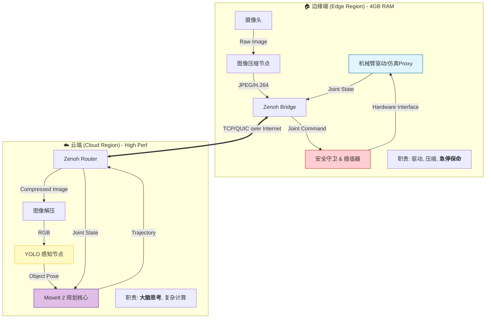

# Dynamic-Vision-Integrated-Sorting-System

## —— 基于 Zenoh 的云边协同架构 (Cloud-Edge Asynchronous Architecture)

### 🛑 第一步：兵棋推演 (Product Strategy & Gap Analysis)

#### 1. 定位与差异化 (Positioning)
*   **传统方案 (Legacy)**：
    *   **All-in-One**：要求本地有一台昂贵的工作站（32GB RAM + RTX 显卡），对学生和普通开发者门槛极高。
    *   **局域网限制**：机器人必须和控制器在同一 WiFi 下，无法实现广域网（WAN）远程操控。
*   **我们的方案 (The IronSight Way)**：
    *   **算力卸载 (Compute Offloading)**：将沉重的 AI 推理（YOLO）和 运动规划（MoveIt）剥离到云端。
    *   **低配即战 (Lightweight Edge)**：本地仅需 4GB 内存的“弱终端”（树莓派/旧电脑）即可驱动复杂机器人。
    *   **无限距离 (Global Reach)**：基于 Zenoh 协议，实现在家里的电脑控制位于北京数据中心的仿真大脑，或反之。

#### 2. 核心价值 (Value Proposition)
> **“让 4GB 内存的边缘设备，拥有 3090 显卡的云端大脑。”**
> 构建一套工业级、低延迟、抗弱网的云原生机器人开发框架。

#### 3. 技术栈谈判 (Tech Stack Lock)
*   **操作系统**: Debian 12 (Bookworm) [Edge & Cloud]
*   **中间件**: **ROS 2 Jazzy Jalisco** (LTS)
*   **通信核心**: **Eclipse Zenoh** (替代默认 DDS，实现 WAN 通信)
*   **容器化**: **Docker + Docker Compose** (确保环境一致性)
*   **编程语言**:
    *   **Python 3.11+**: 业务逻辑、AI 推理、胶水代码。
    *   **C++**: (可选) 仅用于底层驱动或性能敏感的图像编解码。

---

### 🏗️ 第二步：排兵布阵 (Deep-Dive Architecture)

这是针对 **“存算分离”** 特别定制的架构图。我们将系统物理上切分为两半，逻辑上通过 Zenoh 缝合。

#### 1. 系统全景 (System Overview)



#### 2. 核心链路数据流 (Critical Data Path)

1.  **上行链路 (感知流)**：
    *   边缘端采集 1080p 图像 -> **压缩** (降低带宽占用) -> 通过 Zenoh 发送 -> 云端解压 -> YOLO 识别 -> 计算 6D 位姿。
2.  **下行链路 (控制流)**：
    *   云端 MoveIt 生成轨迹 (包含 50 个路径点) -> 通过 Zenoh 发送 -> **边缘端安全守卫**接收。
3.  **安全闭环 (Safety Loop)**：
    *   **关键设计**：边缘端必须包含一个“看门狗”。如果云端网络延迟超过 500ms，或者云端下发了极其离谱的指令，边缘端必须**拒绝执行**或**触发急停**。

#### 3. 组件解构 (Component Anatomy)

我们需要开发以下 4 个核心 Package：

| 位置 | 包名 (Package) | 职责 (Single Responsibility) | 关键策略 |
| :--- | :--- | :--- | :--- |
| **Edge** | `vgss_edge_driver` | 硬件抽象与状态上报。 | 仅发布 `/joint_states`，仅订阅 `/safe_command`。 |
| **Edge** | `vgss_security` | **[最重要]** 网络延迟监控、轨迹平滑插值、急停逻辑。 | 如果 Zenoh 心跳丢失，立即锁死电机。 |
| **Cloud** | `vgss_vision_brain` | 图像解压、YOLO 推理、坐标转换 (TF)。 | 使用 PyTorch/ONNX Runtime。 |
| **Cloud** | `vgss_motion_planner` | 维护 Robot Model，运行 MoveIt MoveGroup。 | 纯计算，不直接连接硬件，只输出轨迹数据。 |

#### 4. 难点预警 (Risk Analysis)

1.  **时间同步 (Time Synchronization)**：
    *   **问题**：云端和边缘端时间戳不一致，导致 TF 变换报错（"Lookup would require extrapolation into the future"）。
    *   **对策**：不依赖系统时间。在图像消息中打上“逻辑时间戳”或“序列号”，云端处理时基于该序列号计算，忽略绝对时间差；或者两端强制 NTP 对时。
2.  **带宽抖动 (Jitter)**：
    *   **问题**：图像传输卡顿。
    *   **对策**：在边缘端实现动态压缩率（网络差时降低画质，保帧率）。
3.  **数据序列化开销**：
    *   **问题**：Python 的序列化较慢。
    *   **对策**：使用 Zenoh 的 Zero-Copy 特性（在 C++ 层），或者在 Python 中精简消息结构。

#### 5. 作战路线图 (Revised Roadmap)

*   **MS-1: 通信基座 (Connectivity)** ✅ *(你目前在这里)*
    *   Docker 环境搭建，Zenoh 互通，Hello World 验证。
*   **MS-2: 遥视千里 (Remote Vision)**
    *   边缘端发送压缩图像 -> 云端还原并显示。
    *   云端 YOLO 识别物体 -> 画框回传给边缘端 Foxglove 显示。
*   **MS-3: 影子武士 (Digital Shadow)**
    *   边缘端发布虚拟关节角度 -> 云端 Gazebo 中的机械臂同步动作。
*   **MS-4: 远程操控 (Teleoperation)**
    *   云端规划轨迹 -> 发送给边缘端 -> 边缘端执行。
    *   集成安全看门狗。
*   **MS-5: 闭环交付 (Final Delivery)**
    *   完整流程：看 -> 算 -> 抓。

---

### 🏗️ 第 1 步：铸造通用镜像 (The Universal Image)

我们需要构建一个同时包含 ROS 2 Jazzy 和 Zenoh 通信模块的 Docker 镜像。这个镜像在云端和本地通用。

**操作对象**：请在 **云端** 和 **本地** 分别执行本步骤（或者本地构建好推上去，但分别构建最简单）。

1.  **创建 `Dockerfile`**：
    `vim Dockerfile` (或使用你喜欢的编辑器)，写入以下内容：

    ```dockerfile
    # 使用 ROS 2 Jazzy 官方精简版镜像 (Core) 以节省体积
    FROM osrf/ros:jazzy-ros-core

    # 设置非交互模式
    ENV DEBIAN_FRONTEND=noninteractive

    # 1. 更换软件源并安装 rmw_zenoh
    # 注意：我们先更新 apt，然后安装 zenoh 的 RMW 实现
    RUN apt-get update && apt-get install -y \
        ros-jazzy-rmw-zenoh-cpp \
        ros-jazzy-demo-nodes-cpp \
        iputils-ping \
        net-tools \
        && rm -rf /var/lib/apt/lists/*

    # 2. 设置环境变量，强制使用 Zenoh
    ENV RMW_IMPLEMENTATION=rmw_zenoh_cpp

    # 3. 设置入口点
    COPY ./entrypoint.sh /entrypoint.sh
    RUN chmod +x /entrypoint.sh
    ENTRYPOINT ["/entrypoint.sh"]
    CMD ["bash"]
    ```

2.  **创建 `entrypoint.sh`**：
    `vim entrypoint.sh`，写入：

    ```bash
    #!/bin/bash
    set -e
    source /opt/ros/jazzy/setup.bash
    exec "$@"
    ```

3.  **构建镜像** (这一步可能需要几分钟)：
    ```bash
    docker build -t vgss-base:latest .
    ```

    *如果这一步报错，请立即把报错信息发给我。如果成功，你会看到 `Successfully tagged vgss-base:latest`。*

---

### ☁️ 第 2 步：云端布阵 (Cloud Deployment)

**操作对象**：仅在 **云端服务器** 执行。

1.  **创建 `compose-cloud.yaml`**：
    `vim compose-cloud.yaml`，写入：

    ```yaml
    services:
      cloud-brain:
        image: vgss-base:latest
        container_name: vgss_cloud
        network_mode: host  # 使用 Host 模式，性能最好且端口开放无阻碍
        environment:
          - RMW_IMPLEMENTATION=rmw_zenoh_cpp
          # 设为 Router 模式，这很重要，它充当网络中心节点
          - ZENOH_ROUTER_CHECK_PEERS=true
          - ZENOH_LISTEN=tcp/0.0.0.0:7447
        command: >
          bash -c "echo '☁️ Cloud Listener Started...' &&
          ros2 run demo_nodes_cpp listener"
        restart: unless-stopped
    ```

2.  **启动云端**：
    ```bash
    docker compose -f compose-cloud.yaml up -d
    ```

3.  **查看日志**：
    ```bash
    docker logs -f vgss_cloud
    ```
    *你应该看到 `[INFO] [listener]: Waiting for data...`。保持这个窗口打开，或者放到一边。*

---

### 🏠 第 3 步：边缘突击 (Edge Deployment)

**操作对象**：仅在 **本地 (4GB 机器)** 执行。

1.  **创建 `compose-edge.yaml`**：
    `vim compose-edge.yaml`，写入：
    **⚠️ 重要：请将 `<CLOUD_IP>` 替换为你云服务器的真实公网 IP！**

    ```yaml
    services:
      edge-arm:
        image: vgss-base:latest
        container_name: vgss_edge
        # WSL2 推荐使用默认 bridge 模式，但需要指定 ZENOH_PEER
        environment:
          - RMW_IMPLEMENTATION=rmw_zenoh_cpp
          # 连接到云端 Router
          - ZENOH_PEER=tcp/<CLOUD_IP>:7447
        command: >
          bash -c "echo '🏠 Edge Talker Started...' &&
          ros2 run demo_nodes_cpp talker"
        restart: unless-stopped
    ```

2.  **启动边缘端**：
    ```bash
    docker compose -f compose-edge.yaml up -d
    ```

3.  **查看日志**：
    ```bash
    docker logs -f vgss_edge
    ```
    *你应该看到 `[INFO] [talker]: Publishing: 'Hello World: 1'`...*

---

### 🔍 第 4 步：最终验证 (Verification)

这是判定 MS-1 是否成功的唯一标准。

1.  回到你的 **云端服务器** 终端。
2.  查看正在运行的日志：`docker logs -f vgss_cloud`
3.  **成功的标志**：
    你必须看到类似下面的输出：
    ```text
    [INFO] [listener]: I heard: [Hello World: 1]
    [INFO] [listener]: I heard: [Hello World: 2]
    [INFO] [listener]: I heard: [Hello World: 3]
    ...
    ```

#### 🚨 常见故障排查 (Troubleshooting)

如果 **本地在发 (Publishing)**，但 **云端没收 (Waiting for data)**，通常只有两个原因：

1.  **防火墙拦截**：
    *   云服务器（阿里云/腾讯云/AWS）的 **安全组 (Security Group)** 没有放行 TCP 端口 **7447**。
    *   *解决*：去云控制台，添加一条入站规则：协议 TCP，端口 7447，源 IP 0.0.0.0/0。

2.  **IP 填写错误**：
    *   检查 `compose-edge.yaml` 里的 `<CLOUD_IP>` 是否填对。不要填成 `127.0.0.1` 或内网 IP。
